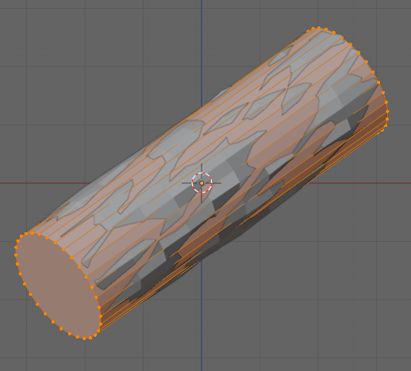

# cylinderfit

a Blender add-on to fit a cylinder to a collection of selected vertices.

Tested with Blender 4.4

## installation

- Download cylinderfit.zip
- Install from Preferences -> Add-ons
- Enable the add-on

It will now be available in the 3d-View, in edit mode, from the Add menu

### updating

Make sure to remove the old version of the add-on first, and **then exit Blender**
before reinstalling the new version of the add-on. (We do not force sub modules to reload yet
so just removing and reinstalling without exiting Blender may fail.)

## usage

- Select the mesh object that contains the points
- Select all vertices that the fit should use
- Select Add -> Fit cylinder to selected

A new, separate cylinder mesh will be added in edit mode, that fits the vertices as well as possible.

## caveats

There currently is no feedback on progress, which might be a bit annoying if fitting takes a lot of time.

## credits

The cylinder fitting code was adapted from https://github.com/xingjiepan/cylinder_fitting which in turn was based on the algorithms described in https://www.geometrictools.com/Documentation/LeastSquaresFitting.pdf

To remove dependencies on external packages (except numpy, which is included with Blender), we replaced the `scikit.optimize.minimize` function with a different implementation of Powells' minimization function from https://cxc.harvard.edu/sherpa/methods/fminpowell.py.txt

## todo

Possible improvements:

- add a progress indicator
- optimizing performance if possible
- further clean up the code bases by removing unused features

## notes

The code forces reload of the submodules `fitting` and `powell`. This is necessary to make updating an add-on in Blender easier: If an add-on is a package and contains submodules, those submodules are not removed from the interpreter thread when removing and then (re)installing a new version of the add-on. This happens because there is just a single Python interpreter and loaded modules are cached.

To prevent having to remember to exit Blender after removing the add-on and then starting Blender again to (re)install the add-on, we force a reload of any submodule the add-on defines itself. It is not necessary to do this for other modules, like Python standard modules or even the bundled `numpy`, because those are part of Blender and only change if you update Blender itself.